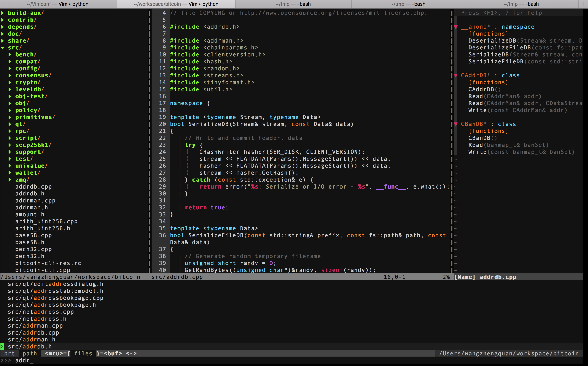

[https://wangzhengquan.github.io/vim/](https://wangzhengquan.github.io/vim/)

I have integrate all the popular vim plugin in a shell script. You can install all of them with just one command as illustrated in Quick Install.

## Quick Install：
Stick the follow command in you terminal：
```
wget -qO- https://wangzhengquan.github.io/vim/install.sh | bash
```
or
```
/bin/bash -c "$(curl -fsSL https://wangzhengquan.github.io/vim/install.sh)"

```

## Screenshot

## Usage
* `F2` Trigger NERD Tree
* `F6` Trigger tagbar
* `:CtrlP` Find files,like 'find' 
* `:Ack [option] text `: Search text in files,like 'grep' 

## Plugins

* [NERD Tree](https://github.com/scrooloose/nerdtree):
The NERDTree is a file system explorer for the Vim editor. Using this plugin, users can visually browse complex directory hierarchies, quickly open files for reading or editing, and perform basic file system operations.
* [Powerline](https://github.com/powerline/powerline):Powerline is a statusline plugin for vim,
* [molokai](https://github.com/tomasr/molokai):Molokai color scheme for Vim
* [YouCompleteMe](https://github.com/Valloric/YouCompleteMe): A code-completion engine for Vim 
* [comments.vim](https://www.vim.org/scripts/script.php?script_id=1528 ):comment utility
* [indentLine](https://github.com/Yggdroot/indentLine): 
This plugin is used for displaying thin vertical lines at each indentation level for code indented with spaces.
* [tagbar](https://github.com/majutsushi/tagbar):tagbar is a Vim plugin that provides an easy way to browse the tags of the current file and get an overview of its structure.
* [ctrlp](https://github.com/ctrlpvim/ctrlp.vim): Full path fuzzy file, buffer, mru, tag, ... finder for Vim.
*  [tabular](http://vimcasts.org/episodes/aligning-text-with-tabular-vim/) : it's useful to line up text..
* [ack.vim](https://github.com/mileszs/ack.vim): Run your favorite search tool from Vim, with an enhanced results list.
* [markdown](https://github.com/suan/vim-instant-markdown):markdown view
* [NERD Commenter](https://github.com/scrooloose/nerdcommenter):NERD Commenter  
用法：
  
```
,ca在可选的注释方式之间切换，比如C/C++ 的块注释/* */和行注释//  
,cc注释当前行  
,c<space> 切换注释/非注释状态  
,cs 以”性感”的方式注释  
,cA 在当前行尾添加注释符，并进入Insert模式  
,cu 取消注释  
,c$ 从光标开始到行尾注释  ，这个要说说因为c$也是从光标到行尾的快捷键，这个按过逗号（，）要快一点按c$  
2,cc 光标以下count行添加注释   
2,cu 光标以下count行取消注释  
2,cm:光标以下count行添加块注释(2,cm)  
Normal模式下，几乎所有命令前面都可以指定行数  
Visual模式下执行命令，会对选中的特定区块进行注释/反注释 
 
```


